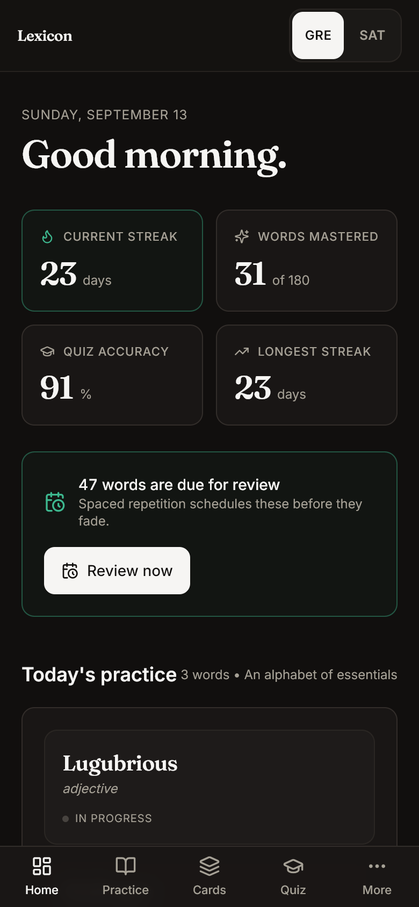
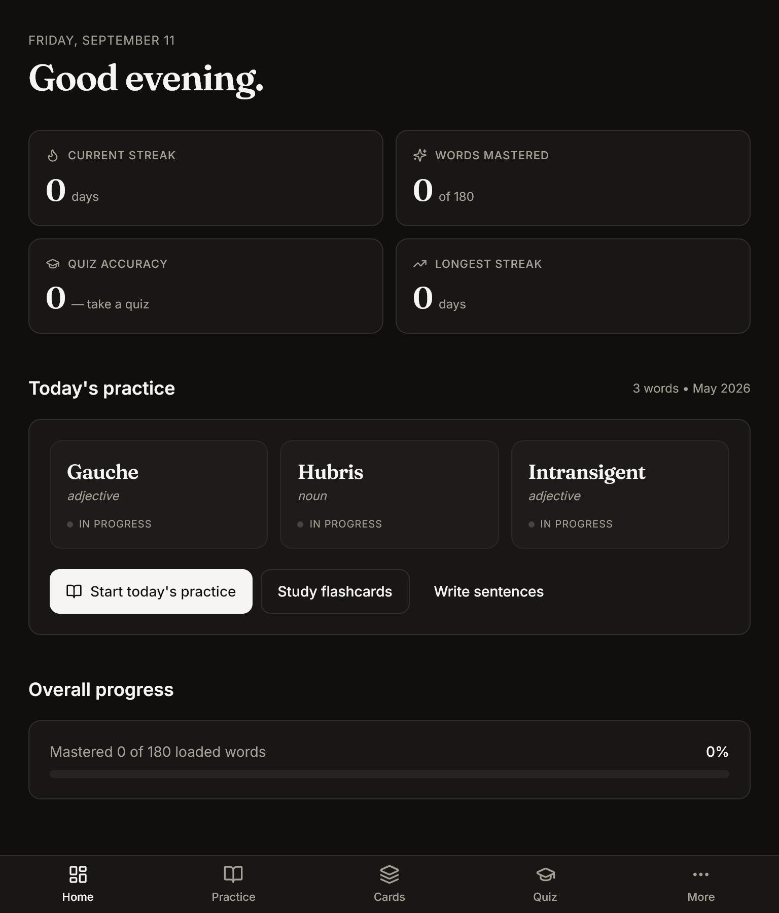
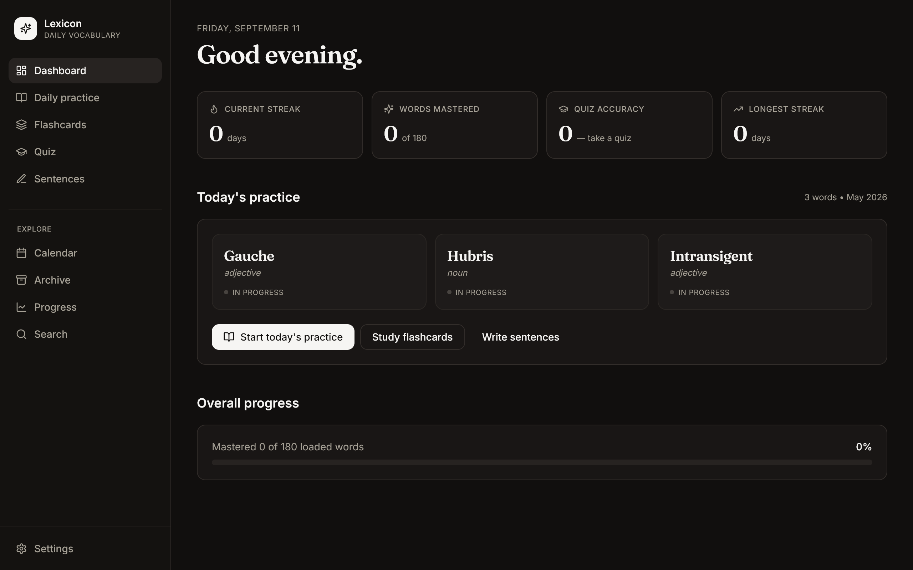

# Lexicon

A premium daily vocabulary practice app. Learn a few new words each day, track your growth over months and years, quiz yourself, and write sentences that get checked for grammar and correct usage.

Two vocabularies — **GRE** and **SAT** — each three years long, each with its own schedule and its own progress. Switching between them is like opening a different notebook: nothing is lost, nothing is merged, and coming back finds it as you left it.

Built with React 18, TypeScript, Tailwind, Framer Motion, and Tauri v2 — runs as either a native desktop app or a plain web app.

> **New to this codebase?** Start with [`CONTINUING.md`](./CONTINUING.md) for state and conventions, then [`ROADMAP.md`](./ROADMAP.md) for what's next. [`CHANGELOG.md`](./CHANGELOG.md) records what shipped. AI coding assistants also pick up [`CLAUDE.md`](./CLAUDE.md), [`AGENTS.md`](./AGENTS.md), [`.cursor/rules/main.mdc`](./.cursor/rules/main.mdc), and [`.github/copilot-instructions.md`](./.github/copilot-instructions.md) automatically.

## How it looks

One shell, three shapes, and the breakpoints come from real devices rather than
from framework defaults:

| Width | Navigation |
| --- | --- |
| below 720px | Bottom tab bar — five destinations, the rest behind **More** |
| 720–1023px | A 76px icon rail, all ten destinations, labelled |
| 1024px and up | The full sidebar |

720px rather than Tailwind's `md` because the iPad mini is 744px wide in
portrait: the default would have put thumb tabs at the bottom of an 1133px-tall
screen, and given two iPads a user thinks of as the same device different
navigation. Pages never learn which shell is showing.

Below `lg` the app is **fullscreen**: content is full-bleed, height is
`100dvh` so a phone's address bar stops covering the last rows, and the page
paints under the notch with safe areas on all four edges. Reading pages still
cap their line length — extra width becomes margin or a second column, never a
longer line.

| Phone — 390px | Tablet — 768px |
| --- | --- |
|  |  |



Touch targets are keyed to the *pointer*, not the width — a narrow window on a
desktop keeps its density, and a large tablet still gets 44px targets. Verified
by `scripts/drive/` at 360px and across five tablets in both orientations: no
page scrolls horizontally, every target on a touch pointer is at least 44px,
every control has a name, and rotating the device keeps the card you were on.

## Features

- **Two tracks** — GRE and SAT, switched from a control that is visible on every screen. Separate content, separate schedules, separate progress; one streak, because showing up is showing up
- **Start whenever you like** — pick the month you begin and the app lays three years out from there. Reorder the months, or reshuffle the words, without losing a day of progress
- **Daily practice** — animated flashcards with definition, example, and mnemonic
- **Custom calendar** — jump to any month, quarter, or day; days without vocabulary are dimmed
- **Quiz mode** — three modes (word→def, def→word, mixed) with any pool: mastered, current month, or everything
- **Sentence builder** — write practice sentences; get feedback via Anthropic API or local heuristics
- **Progress tracking** — activity heatmap, monthly/quarterly/yearly charts, current & longest streaks
- **Archive** — every month you've loaded, always browsable
- **Search** — full-text across all loaded vocabulary
- **JSON-driven** — one file per month, dropped in a folder. Load, unload, keep as many as you want
- **Backup / restore** — export everything as JSON
- **Light & dark themes** — with warm off-white / near-black palettes
- **Flashcard navigation** — arrows at the card's left and right edges, hidden until you hover, focus or tap; swipe or drag to move between cards; `←` `→` do the same. Rating keeps its own buttons, so a swipe can never record a judgement you did not mean
- **Works on a phone and a tablet** — one responsive shell: tab bar, icon rail, sidebar. 44px touch targets, safe-area aware, fullscreen below `lg`

## Quick start (web app)

```bash
npm install
npm run dev
```

Opens at http://localhost:1420. Comes pre-seeded with April and May 2026 (180 GRE-level words).

## Quick start (desktop app via Tauri)

Prerequisites: [Rust toolchain](https://www.rust-lang.org/tools/install), plus platform-specific build tools ([macOS](https://tauri.app/start/prerequisites/#macos), [Windows](https://tauri.app/start/prerequisites/#windows), [Linux](https://tauri.app/start/prerequisites/#linux)).

```bash
npm install
npm run tauri:dev        # Development mode
npm run tauri:build      # Produces installers in src-tauri/target/release/bundle/
```

## Loading your own vocabulary

Vocabulary files are JSON with this shape:

```json
{
  "track": "gre",
  "ordinal": 6,
  "title": "Concealment and disclosure",
  "days": [
    {
      "day": 1,
      "words": [
        {
          "word": "Ineffable",
          "partOfSpeech": "adjective",
          "definition": "Too great or extreme to be expressed in words.",
          "example": "The view from the summit had an ineffable beauty.",
          "mnemonic": "'In-' (not) + 'effable' (utterable) — cannot be uttered."
        }
      ]
    }
  ]
}
```

There is **no calendar in a vocabulary file**. `ordinal` is a teaching
position — month six of the track — and which calendar month you study it in
comes from your own schedule. Two people starting a year apart share these
files byte for byte.

Files written before tracks existed, with `month` and `displayName`, still
import: the parser reads them and the app files them where you say.

### CSV

CSV is accepted anywhere JSON is. It is converted to the shape above and then
put through exactly the same validation, so the rules do not differ.

```csv
word,partOfSpeech,definition,example,mnemonic,day
abate,verb,To lessen in intensity.,The storm abated by dawn.,"a-BATE, like bait shrinking",1
cogent,adjective,Clear and convincing.,She made a cogent argument.,"cogent = co-agent, persuasive",1
```

- **Required columns:** `word`, `partOfSpeech`, `definition`, `example`,
  `mnemonic`, `day`.
- **Optional columns:** `month` (`YYYY-MM`), `id`, `synonyms`, `antonyms`.
  Synonyms and antonyms are semicolon-separated: `terse;curt`.
- **Header names are forgiving** — `Part of Speech`, `part_of_speech` and `POS`
  all resolve to `partOfSpeech`; `Term` works for `word`, `Meaning` for
  `definition`, `Memory Aid` for `mnemonic`.
- **Which month?** A `month` column wins. Otherwise the filename is used if it
  contains one (`2026-07.csv`), and failing that the current month. One CSV may
  span several months; each becomes its own month, because a month is the unit
  of loading everywhere in the app.
- Quoted fields, embedded commas and newlines, and doubled quotes (`""`) are
  handled per RFC 4180.

Errors name the line: `Line 4: 'day' must be a whole number 1-31, got "nope"`.

### Four ways to load

1. **Drag and drop** — drop `.json`, `.csv` or `.apkg` files anywhere in the app
2. **Import button** — "Import JSON / CSV" on the Dashboard or Archive
3. **Pick a folder** — in browser (Chrome/Edge only) or Tauri, load a whole folder at once
4. **Auto-seed** — files in `src/data/` are bundled and loaded on first run

All four go through the same validation, so a file one accepts they all accept.

## Generating vocabulary with Claude

Archive has a **Generate with AI** button. Give it a topic, a word count and a
month, and Claude writes the words, definitions, examples and mnemonics.

It uses the Anthropic API key from Settings and is billed to your account.
Words you already have are sent along so the model does not repeat them.

The response is constrained with a strict tool schema rather than parsed out of
prose, and the result is still put through the same validation as an imported
file — generated content is not trusted any more than a file you supplied.

## Importing from Anki

Drop an `.apkg` into the app, or pick it with the import button. Lexicon reads
the notes out of the deck and lands them in the first month you have nothing
loaded in, three words per day.

Anki decks have no fixed schema, so fields are matched by **name** first —
`Word`/`Term`/`Front` for the word, `Definition`/`Meaning`/`Back` for the
meaning, and `Example`, `Mnemonic` and `Part of Speech` where present. A deck
whose fields match none of those falls back to "first field is the word, second
is the meaning", which is what a two-field note almost always is. Missing
example and mnemonic fields show as `—`.

Notes with no word or no meaning are skipped and counted. HTML, `[sound:…]`
references and entities are stripped.

Two limits worth knowing:

- **Scheduling is not imported.** Lexicon's progress is keyed by its own word
  ids, and inventing review history for words you have not seen here would be
  worse than starting fresh. Export the other way *does* carry scheduling.
- **Anki's newer compressed format is not readable.** If you get an error
  saying so, re-export from Anki with "Support older Anki versions" ticked.

## Exporting a study log

Settings → Backup → **Export study log (Markdown)** writes a readable record:
totals and streaks, a per-month breakdown, what is due with its interval and
ease, and your last 30 active days. Useful for sharing progress or keeping a
record outside the app.

## Exporting to Anki

Settings has an **Anki export** section that writes every loaded month to a
standard `.apkg` file. Choose one deck per month (as subdecks of a top-level
deck you name) or a single deck for everything.

Review scheduling travels with the cards. A word you have rated in Lexicon
arrives in Anki as a *review* card with its interval, ease factor and
repetition count intact, due on the same day Lexicon would have shown it —
not reset to new. Words you have never rated arrive as new cards.

The file is Anki's legacy schema 11, the format `genanki` produces and current
Anki still imports. The SQLite and zip libraries needed to build it are
downloaded only the first time you export, so they cost nothing to anyone who
does not use the feature.

## Sentence verification

Two modes, chosen based on Settings:

- **AI verification** (recommended) — sends the word, its definition, and your sentences to Anthropic's API. Returns per-sentence feedback on grammar and correct usage. Add your API key in Settings; it's stored locally in your browser only.
- **Heuristic** (fallback) — local checks: does the sentence use the word (with morphological variants), is it capitalized, does it have punctuation, is it long enough, does it look copy-pasted from the example.

## Data model

- `src/types/index.ts` — all interfaces
- `src/lib/track.ts` — tracks, month keys, word ids
- `src/lib/schedule.ts` — the only place a teaching position becomes a date
- `src/lib/vocabulary.ts` — parser and validator
- `src/lib/migrations/` — storage migrations, run before any store hydrates
- `src/lib/verify.ts` — heuristic + API verification
- `src/lib/streak.ts` — streak calculation
- `src/store/` — Zustand stores (vocab, progress, settings, app nav)

Three ideas hold the rest up:

**A word's id names its track, never a date.** `gre-abstemious`, not
`2026-04-abstemious`. Progress records are keyed by that id, so a word can
move to a different month — because you reordered, or reshuffled, or started
somewhere else — and keep every review it has ever had.

**Months are positions, not dates.** They are keyed `gre/01` … `gre/36`, and a
per-track `Schedule` maps those positions onto the calendar. Changing when you
start, or in what order the months run, is a permutation of integers: no
content moves and no progress is touched.

**Uniqueness is a within-track guarantee.** No word appears twice in the GRE
corpus, or twice in the SAT one. A word appearing in *both* is not a duplicate —
the two are separate curricula whose overlap is the useful middle of the
academic register, and forcing them apart would leave SAT the leftovers.

Progress is stored in `localStorage` under keys prefixed with `lexicon.*`. See
[`docs/adr/0011-tracks.md`](./docs/adr/0011-tracks.md),
[`0012`](./docs/adr/0012-ordinal-content.md) and
[`0013`](./docs/adr/0013-cross-track-overlap.md) for why each of those is the
way it is, and [`docs/SCHEDULE.md`](./docs/SCHEDULE.md) for the schedule.

## Project structure

```
src/
├── App.tsx, main.tsx        Root
├── components/              Presentation
│   ├── ui/                  Primitives (Button, Card, Dialog, ...)
│   ├── FlashCard.tsx        Flip-reveal word card
│   ├── CalendarPicker.tsx   Custom calendar with unselectable days
│   ├── JsonImporter.tsx     File / folder import
│   ├── Sidebar.tsx          Navigation
│   ├── Toast.tsx
│   └── EmptyState.tsx
├── pages/                   Route views
│   ├── Dashboard.tsx        Overview + today's words
│   ├── DailyPractice.tsx    Flashcards for a day
│   ├── Quiz.tsx             Setup / play / results
│   ├── SentenceBuilder.tsx  Write & verify
│   ├── Calendar.tsx         Date picker + preview
│   ├── Archive.tsx          All loaded months
│   ├── ProgressPage.tsx     Heatmap + charts
│   ├── Search.tsx           Full-text
│   └── Settings.tsx         Theme, API key, backup, reset
├── store/                   Zustand stores
├── lib/                     Pure logic (no React)
├── types/                   TypeScript types
├── data/                    Bundled vocabulary
└── styles/globals.css       Tailwind + design tokens
```

## Keyboard shortcuts

Press `?` anywhere for the list. `/` jumps to search; `g` followed by a letter
moves between pages (`g d` dashboard, `g f` flashcards, and so on). Shortcuts
never fire while you are typing in a field.

## Sharing a deck

Archive has a share button on each month: it copies the deck as a `lex1:` code
you can paste into a message. **Paste deck code** takes one back. Codes are
gzipped and base64url, so they survive URLs and chat clients. Only the
vocabulary travels — your review history stays yours.

## Desktop extras

The Tauri build adds things the browser cannot do:

- **Watched folder** — point Lexicon at a folder in Settings, and any `.json`,
  `.csv` or `.apkg` dropped into it loads immediately, with no re-import.
- **System tray** — quick access to the window or straight into a session.
- **Global shortcut** — `Ctrl/Cmd+Shift+L` opens Lexicon and starts studying.

Building the desktop app needs a Rust toolchain (`rustup`) plus a platform C
compiler — the MSVC build tools on Windows.

## Tests

```bash
npm test              # once
npm run test:watch    # while working
```

Vitest, across three layers:

- **`src/lib/`** — the spaced-repetition scheduler, CSV parsing, the Anki reader
  and writer, the vocabulary generator, sentence verification, Markdown export.
- **`src/store/`** — the three Zustand stores, including the invariant that
  progress survives reloading the same vocabulary.
- **`src/components/`** — the drag-and-drop overlay's event handling and the
  per-word detail modal.

Most tests run in a node environment; component tests opt into jsdom with a
`@vitest-environment jsdom` docblock, so the fast majority stays fast.

The Anki tests build a real collection with the exporter and read it back with
the importer, through real SQLite. The two files that call the Anthropic API are
tested with `fetch` stubbed, which pins the request shape and every error path
without spending anything.

## Scripts

| Command | What it does |
| --- | --- |
| `npm run dev` | Vite dev server at :1420 |
| `npm run build` | Production build to `dist/` |
| `npm run typecheck` | Type-check without emit |
| `npm run lint` | ESLint |
| `npm run tauri:dev` | Tauri desktop app in dev mode |
| `npm run tauri:build` | Bundle native installers |

Content and verification, run with `npx tsx`:

| Command | What it does |
| --- | --- |
| `scripts/generate-corpus.ts --track sat` | Generate a track's corpus through the `claude` CLI. Takes a lock; resumes where it stopped |
| `scripts/repair-corpus.ts --track sat` | Dedupe a track and top up short months |
| `scripts/audit-corpus.ts` | Check every track with the app's own parser, stemmer and quality rules |
| `scripts/build-vocab-index.ts` | Rebuild `public/vocab/index.json` so the library can list months without downloading them |
| `scripts/render-icon.mjs` | Rasterise `public/icon.svg` for `tauri icon` |

Browser drivers live in [`scripts/drive/`](./scripts/drive/) and need a Chromium
path in `CHROME_EXE`. They cover accessibility and contrast, keyboard and focus,
phone and tablet layout, the tracks migration, the schedule, and the flashcard
gestures — the things a unit test cannot see.

## Roadmap

See [`ROADMAP.md`](./ROADMAP.md) for the phased plan with priorities and acceptance criteria. High-level phases:

1. **Foundation** — shipped in v0.1.0
2. **Learning quality** — spaced repetition (SM-2), due-today deck
3. **Content flow** — CSV import, Anki `.apkg` export, generate-with-AI
4. **Multi-device & desktop parity** — real file-watching, native icons, mobile
5. **Polish, community, sharing** — global shortcuts, deck sharing, onboarding

## License

MIT
